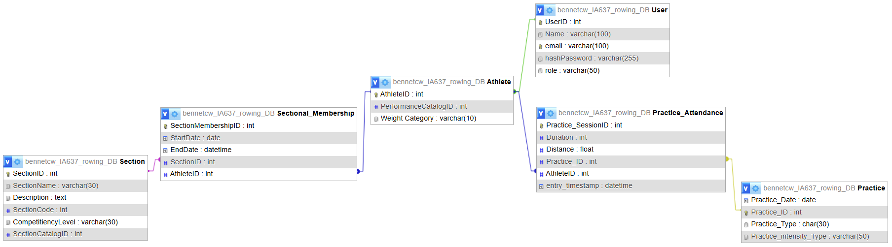

# Clarkson Rowing Attendance System
### Data Driven App Development — Final Project

## Group Members
* **Akshay Thugudam**
* **Cole Bennett**

## Narrative: App Purpose
The **Clarkson Rowing Attendance System** is designed to digitize the practice attendance tracking for the Clarkson University Rowing team. Historically, attendance has been tracked via google sheets, which led to data consistency issues and made long-term analysis difficult.

This application solves that problem by:
1.  **Centralizing Data**: Storing all athlete, practice, and attendance data in a relational MySQL database.
2.  **Self-Service Logging**: Allowing athletes to log into their own dashboard and "mark themselves present" for specific practices, reducing administrative overhead.
3.  **Real-Time Analytics**: Providing coaches (Admins) with instant calculations of attendance percentages, "Absent/Present" counts, and performance metrics (meters rowed/minutes trained).
4.  **Enforcement**: Features like email reminders for low-attendance athletes and strict constraints (e.g., preventing attendance logging for future dates) help enforce team standards and data integrity.

## User Roles & Credentials
The system supports two distinct user roles with different permissions.

| Role | Purpose | Permissions | Example Credentials |
| :--- | :--- | :--- | :--- |
| **Admin** | Coaching Staff or Captain | • Create/Delete Practices<br>• Manage Users (Promote/Delete)<br>• View Team Analytics<br>• Send Email Reminders<br>• Export Reports (PDF/CSV) | **Email:** `boris@clarkson.edu`<br>**Password:** `knight2025` |
| **Athlete** | Team Member | • View Practice Schedule<br>• Record Attendance<br>• View Personal History<br>• Edit Performance Stats (Distance/Duration) | **Email:** `tyler@clarkson.edu`<br>**Password:** `clarkson2025` |

## Relational Schema
The application uses a normalized Relational Database Management System (MySQL) consisting of 6 tables. The schema follows a User-Extension pattern where an **Athlete** is a specialized type of **User**.

### Core Tables
1.  **`User`**: The central authentication table containing login credentials (`email`, `hashPassword`) and system access level (`role`).
2.  **`Athlete`**: A 1-to-1 extension of the `User` table. It shares the same Primary Key (`AthleteID` refers to `User.UserID`) and stores rowing-specific attributes like `WeightCategory`.
3.  **`Practice`**: Represents a scheduled training session with attributes for `Date`, `Type` (e.g., Water, Erg), and `Intensity`.

### Relationship Tables
4.  **`Practice_Attendance`**: A many-to-many junction table linking **Athletes** to **Practices**. It records the specific `Duration` and `Distance` for that athlete at that practice. It includes an `ON DELETE CASCADE` constraint, ensuring that deleting a practice automatically removes associated attendance records.
5.  **`Section`**: Defines team cohorts that athletes are grouped into (e.g., "Men's Varsity").
6.  **`Sectional_Membership`**: A junction table tracking which Athlete belongs to which Section, including `StartDate` and `EndDate`.





## Analytical Queries
The application utilizes SQL aggregation functions to generate insights. Below is the primary analytical query used to drive the **Analytics Dashboard** (`/analytics`).

**Purpose:** This query calculates the total volume (meters) and time (minutes) for every athlete, ranking them by performance.

```sql
SELECT 
    u.Name,
    COALESCE(SUM(pa.Distance), 0) as total_meters,
    COALESCE(SUM(pa.Duration), 0) as total_minutes,
    COUNT(pa.Practice_ID) as practices_attended
FROM User u
LEFT JOIN Practice_Attendance pa ON u.UserID = pa.AthleteID
WHERE u.role = 'Athlete'
GROUP BY u.UserID, u.Name
ORDER BY total_meters DESC;
```

# Getting Started / Setup

## 1. Prerequisites
Ensure you have Python 3.x installed along with the following dependencies: 
`pip install flask pymysql bcrypt reportlab flask-mail pyyaml`

## 2. Database Configuration
Open `config.yml` and ensure the database credentials match your MySQL server settings:

```YAML
db:
  user: 'YOUR_USERNAME'
  pw: 'YOUR_PASSWORD'
  host: 'mysql.clarksonmsda.org'
  db: 'your_database_name'
```

## 3. Initialize Data + Add New Users
Run the following scripts to seed your database with the initial Admin and Athlete accounts. This securely hashes their passwords before insertion. These are also the files that should be run to create new users of the App.

Create the Admin user (Boris)
`python create_admin.py`

Create the Athlete user (Tyler)
`python create_athlete.py`

## 4. Run the Application

Execute the main application file:
`python app.py`

*The server will start at http://127.0.0.1:5000.* 


**Use the example credentials listed in the User Roles & Credentials table above to log in.**

